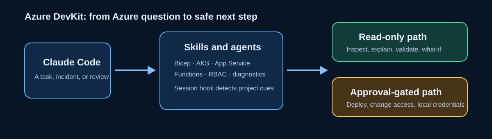
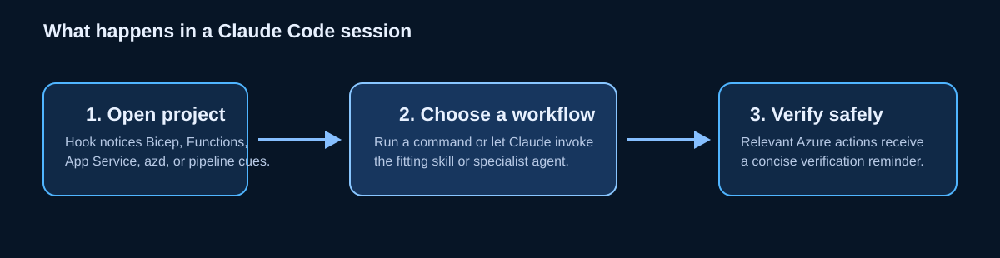
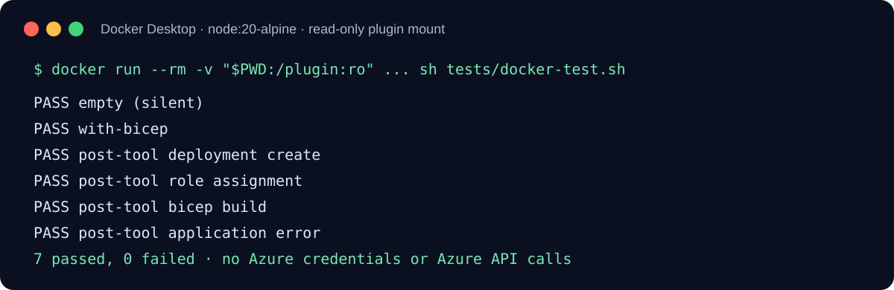

# Azure DevKit for Claude Code

Azure DevKit gives Claude Code a practical Azure operating model: build safer infrastructure, investigate a production symptom, and review access without turning every request into a cloud-changing action. It is designed for individual developers, platform teams, and reviewers who need clear next steps across Bicep, AKS, App Service, Azure Functions, and RBAC.

It is a **Claude Code plugin**. It is not an Azure credential manager, an Azure Portal replacement, or a plugin for the Claude web/desktop chat app.



## Why install it

- Start an incident with a focused diagnostic path for AKS, App Service, or Functions.
- Generate Bicep and Kubernetes manifests that begin with secure, Azure-aware defaults.
- Review broad RBAC assignments before they become a production risk.
- Prepare deployment configuration for App Service and Azure Functions without exposing secret values in the conversation.
- Get a brief Azure-aware note when Claude Code opens a Bicep, Functions, App Service, Azure Pipelines, or `azd` project.

## What you get

| Need | Azure DevKit capability | Typical outcome |
|---|---|---|
| A web app is failing | `az-debug` and the `azure-forensics` agent | Root cause, evidence, safe fix, and verification command |
| A new workload needs infrastructure | `bicep-template` and `bicep-author` | Parameterized Bicep with pinned API versions and a `what-if` handoff |
| AKS needs deployment YAML | `aks-manifest` | Workload Identity, Key Vault CSI, AGIC, probes, and resource limits |
| Access needs review | `rbac-azure-audit` and `full-audit` | Severity-ranked broad-role findings and least-privilege alternatives |
| A project needs a deployment baseline | `app-service-deploy` or `functions-scaffold` | Runtime-appropriate files and local verification steps |

## Install in Claude Code

Azure DevKit supports the Claude Code marketplace flow. This is the supported, updateable route for a GitHub release.

1. Install or update Claude Code, then start it in any project directory.
2. Add the Azure DevKit marketplace:

   ```text
   /plugin marketplace add mohitkale/azure-devkit
   ```

3. Install the plugin and reload the current session:

   ```text
   /plugin install azure-devkit@azure-devkit
   /reload-plugins
   ```

4. Confirm that `/azure-devkit:doctor` appears in the command picker, then run it.

### macOS

Use the current Claude Code installer, sign in, and run the commands above from Terminal, iTerm, or your editor's integrated terminal. Docker Desktop is only needed if you want to run the repository's isolated validation test; the plugin itself does not need Docker.

### Windows

Use current Claude Code with **WSL** or **Git Bash**, as supported by Claude Code. Run the same slash commands from the Claude Code session. For Azure work, install `az`, `kubectl`, and Functions Core Tools inside the same environment where Claude Code runs so they share the same PATH and Azure sign-in.

### About ZIP files and the Claude app

Do not upload a ZIP to Claude web or Claude Desktop expecting this plugin to load. Claude Code plugins are installed from a marketplace, skills directory, or local development path; the Claude desktop/web chat experience has a different integration model. For an offline review, clone the repository and add the local directory as a marketplace:

```text
/plugin marketplace add /absolute/path/to/azure-devkit
/plugin install azure-devkit@azure-devkit
/reload-plugins
```

## Your first five minutes

```text
/azure-devkit:doctor
/azure-devkit:whoami
/azure-devkit:bicep-template app-service api-prod eastus
/azure-devkit:rbac-azure-audit
/azure-devkit:az-debug webapp api-prod rg-prod
```

The plugin tells Claude when it needs a resource name, resource group, runtime, or other information instead of guessing.

## Safety built in

Azure DevKit is intentionally advisory-first.

- Azure deletes, stops, role changes, secret writes, and deployments require explicit approval. Bicep work ends at validation or `what-if`.
- Diagnostic commands are read-only. AKS credential retrieval is never auto-approved because it changes local kubeconfig.
- It does not print Key Vault secret values, App Service setting values, Function setting values, or other secret-bearing output.
- The full RBAC audit does not claim Entra sign-in history, credential age, PIM eligibility, or other data it did not query.
- Hooks run locally. The session hook checks only Azure project markers in the working directory; it sends no telemetry to a plugin-operated service.

## How the plugin behaves



| Command | Use it when | Cloud effect |
|---|---|---|
| `doctor` | You want to check local Azure tooling | Read-only local checks |
| `whoami` | You need to confirm subscription and identity | Read-only Azure queries |
| `full-audit` | You explicitly want environment, identity, and RBAC review | Read-only Azure queries |
| `az-debug` | AKS, App Service, or Functions has a known symptom | Read-only until you approve a change |
| `bicep-template` | You need a reusable Azure resource template | Writes only project files after announcing them |
| `rbac-azure-audit` | You need to find overly broad access | Read-only Azure queries |
| `aks-manifest` | You need AKS-specific workload YAML | Writes only project files after announcing them |
| `app-service-deploy` | You need App Service startup/deploy configuration | Writes only project files after announcing them |
| `functions-scaffold` | You need a Functions starter or trigger | Writes only project files after announcing them |

## Requirements

- Claude Code 2.1.114 or newer is recommended.
- Node.js 18+ enables the two optional local hooks. The commands and skills still work without it.
- Azure CLI and an `az login` are needed only for live Azure diagnostics or audit queries.
- `kubectl` is needed for pod-level AKS diagnosis; Azure Functions Core Tools v4 is needed to run generated Functions locally.

## Tested package snapshot

The repository includes a small, offline Docker Desktop test. It syntax-checks both hooks and feeds representative Claude Code hook events into them. It does not authenticate to Azure, call Azure, or write to the mounted project.



Run it from the repository root:

```bash
docker run --rm -v "$PWD:/plugin:ro" -w /plugin node:20-alpine sh tests/docker-test.sh
```

In PowerShell, use:

```powershell
docker run --rm -v "${PWD}:/plugin:ro" -w /plugin node:20-alpine sh tests/docker-test.sh
```

For an authoritative local package check, also run:

```bash
claude plugin validate . --strict
```

## Release and updates

Every published release should bump `version` in both `.claude-plugin/plugin.json` and `.claude-plugin/marketplace.json`, update `CHANGELOG.md`, then pass the Docker and strict Claude validation checks. Create and push an annotated `v<version>` tag only after the GitHub release branch is reviewed and merged. Users refresh the marketplace with `/plugin marketplace update` and then update the installed plugin from `/plugin`.

## Privacy and limits

See [PRIVACY.md](PRIVACY.md) for the local-data statement. This plugin works with Azure resource configuration and command output available to the signed-in user; it does not replace Microsoft security reviews, change control, or incident response procedures.

## License

MIT. See [LICENSE](LICENSE).
